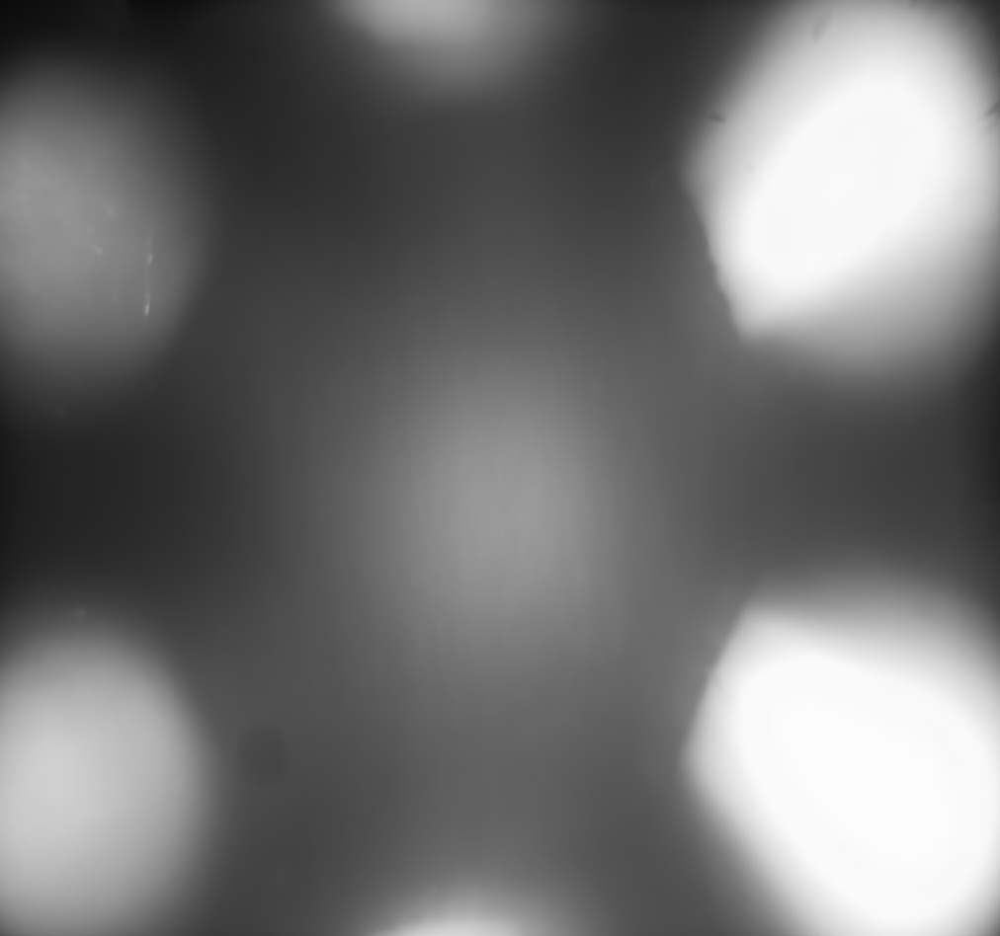
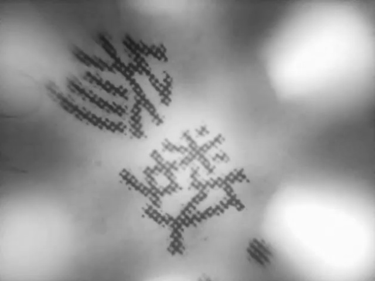
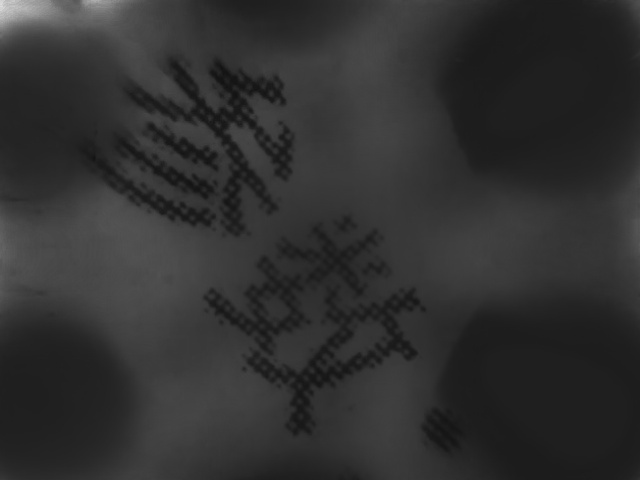
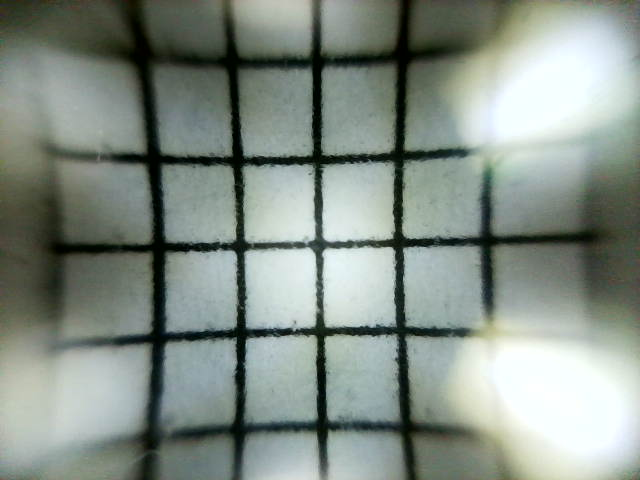
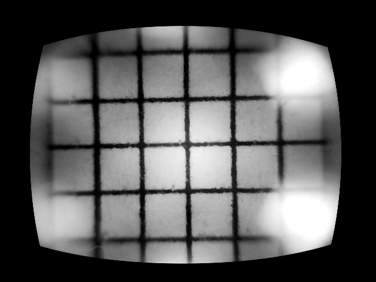
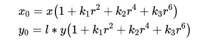
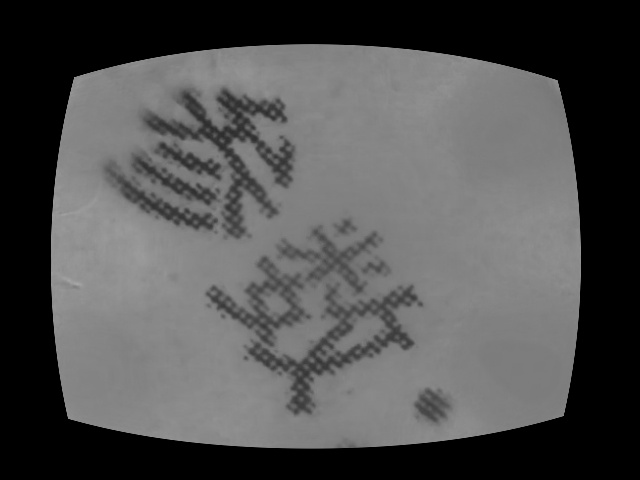
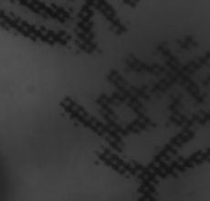

## 步骤

### 视频转图像序列

视频逐帧抽取，并转为灰度图像

[video.mp4](video.mp4)

### 图像序列预处理

- 图像去背景
和自然相机不同，扫描摄像机使用人工光源成像，在不同成像区域的光强不同，图像需要首先去掉如下的背景光强图像：

背景光强图像

原图

去光强后图像

- 图像去畸变
下图是一个正方形窗格在摄像机下的成像，说明摄像机拍摄的图像带有畸变，需要去畸变，我们在此只考虑径向畸变。

原始窗格

真实窗格

成像仪光轴中心的畸变为0，沿着镜头半径方向向边缘移动，畸变越来越严重。畸变的数学模型可以用主点（principle point）周围的泰勒级数展开式的前几项进行描述，通常使用前两项，即k1和k2，对于畸变很大的镜头，如鱼眼镜头，可以增加使用第三项k3来进行描述，成像仪上某点根据其在径向方向上的分布位置，调节公式为：

（x0，y0）是畸变的原图上像素点相对于镜头原点的位置；（x，y）是校正后输出图像上像素点相对于镜头原点的位置。r是校正后图像上像素点相对于镜头原点的距离。镜头原点未知，可以初始化为图像中心.l代表y轴相对于x轴的拉伸比例。
根据图像中的对应点，可以使用数值方法计算调节公式参数，并对图像序列去畸变。

去畸变前图像

去畸变后图像

- 图像取前景区域
人工定义前景区域，从矫正后的图像中取出前景区域，得到可以匹配拼接的范围

去畸变后图像

前景图像

### 图像相关匹配

高帧率情况下，可以以为相邻帧图像间的关系为平移关系。可以根据相关系数计算图像间相对位移。参考步骤是：

- 保持一帧图像不动
- 另一帧图像在小范围内平移，计算每个位移下的图像相关
- 求取相关系数最大的平移量

### 拼接成像

逐帧处理并匹配，拼接得到扫描图像
